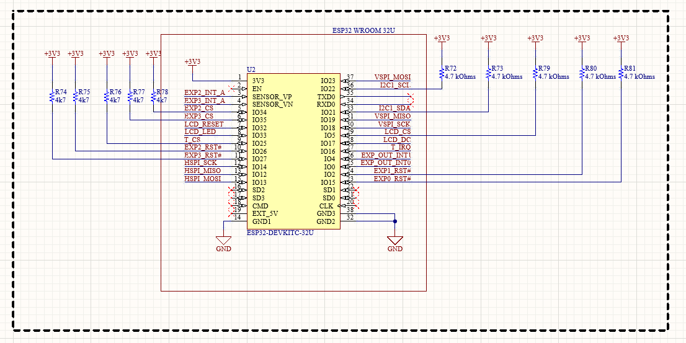
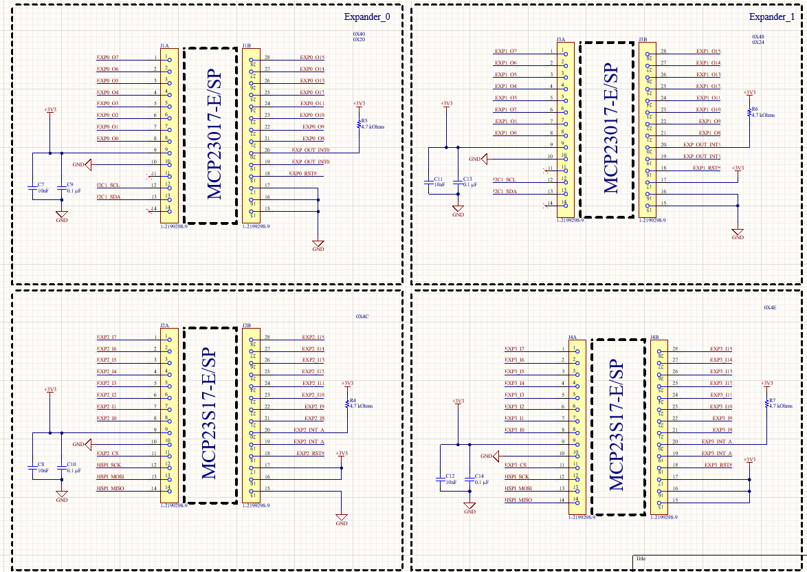
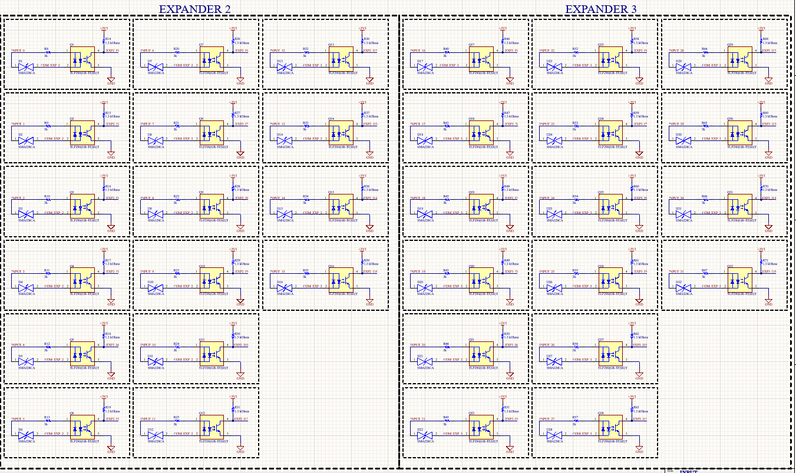
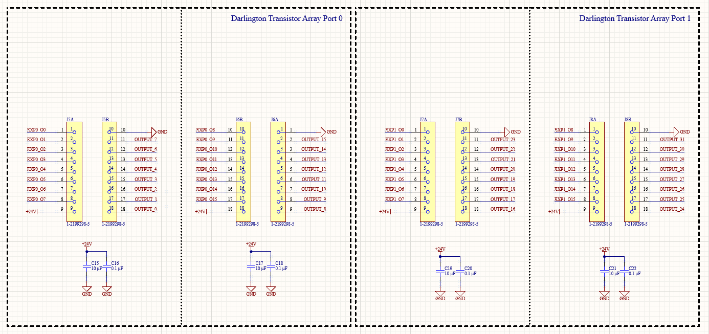
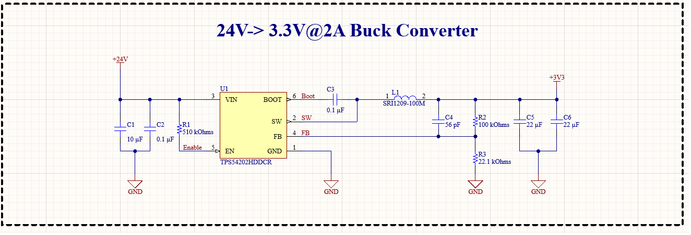
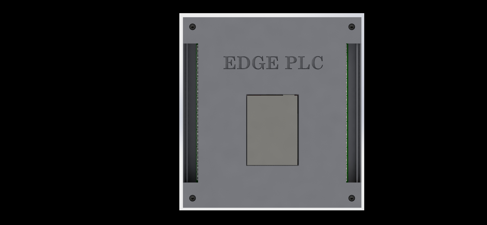
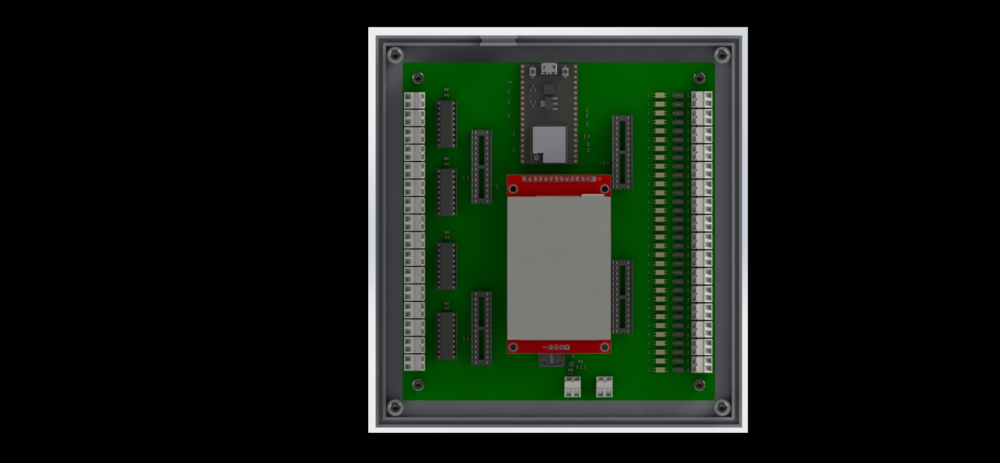

## Proje Hakkında
 
**EDGE PLC**, üretim hattı istasyonları arasındaki uzun kontrol kablolarını ortadan kaldırmak amacıyla tasarlanmış, kablosuz haberleşmeli bir endüstriyel I/O kontrol kartıdır.

32 izole dijital giriş ve 32 Darlington çıkışıyla saha sinyallerini okuyup sürerken, **WiFi 802.11** üzerinden merkezi sisteme veri aktarır. Aynı ağda çalışan birden fazla kart birbirinden bağımsız şekilde haberleşebilir.

Proje; saha analizi, şematik tasarımı, 4 katmanlı PCB düzeni, 3D kasa modelleme ve firmware geliştirme süreçlerini kapsayan uçtan uca bir gömülü donanım çalışmasıdır.

---        

## Özellikler

| | Özellik | Detay |
|---|---|---|
| 🧠 | Mikrodenetleyici | ESP32-WROOM-32U — Xtensa LX6 çift çekirdek, 240 MHz |
| 📡 | Kablosuz Haberleşme | WiFi 802.11 b/g/n, MAC adresli kart tanımlama |
| 🔢 | Dijital Girişler | 32 kanal, optokuplör galvanik izolasyon (TLP290x) |
| ⚡ | Dijital Çıkışlar | 32 kanal, Darlington transistör dizisi, 24V/500mA |
| 🔌 | Besleme | 24V DC endüstriyel standart |
| 🔋 | Lojik Güç | 3,3V @ 2A — TPS54202HDDCR yerleşik buck dönüştürücü |
| 🔗 | I/O Genişletici | 4× MCP23017/MCP23S17 (I²C + SPI, 16-bit) |
| 🧱 | PCB | 4 katman — Top / GND / GND / Bottom |
| 📦 | Kasa | PCB'ye özel 3D modellenmiş endüstriyel kasa |

---

## Donanım Mimarisi

```
┌─────────────────────────────────────────────────┐
│                ESP32-WROOM-32U                  │
│         I²C Bus              SPI Bus            │
└────────────┬─────────────────────┬──────────────┘
             │                     │
   ┌──────────▼──────┐   ┌─────────▼───────────┐
   │  MCP23017 × 2   │   │   MCP23S17 × 2      │
   │  Expander 0 & 1 │   │   Expander 2 & 3    │
   │  I²C: 0x20/0x24 │   │   SPI: CS hatları   │
   └────────┬────────┘   └──────────┬──────────┘
            │ 32 GPIO               │ 32 GPIO
   ┌────────▼────────┐   ┌──────────▼───────────┐
   │  GİRİŞ BLOĞU    │   │    ÇIKIŞ BLOĞU       │
   │  32× TLP290x    │   │  32× Darlington      │
   │  Optokuplör     │   │  24V Yük Sürücü      │
   │  + TVS Koruma   │   │  + Flyback Diyot     │
   └─────────────────┘   └──────────────────────┘

   ┌──────────────────────────────────────────┐
   │            GÜÇ KAYNAĞI                   │
   │    24V DC → TPS54202HDDCR → 3,3V/2A      │
   └──────────────────────────────────────────┘
```

---

## Şematikler

> Şematik görselleri **`schematic/`** klasörü altındadır.

### Mikrodenetleyici — ESP32-WROOM-32U

Ana kontrol birimi. I²C ve SPI hatları üzerinden tüm IO genişleticileri yönetir, WiFi yığınını çalıştırır, uygulama mantığını işler.



---

### I/O Genişleticiler — MCP23017 & MCP23S17

ESP32'den toplamda 64 GPIO pini elde etmek amacıyla 4 adet 16-bit GPIO genişletici kullanılmıştır.

| Genişletici | Tip | Protokol | Adres / CS |
|---|---|---|---|
| Expander 0 | MCP23017-E/SP | I²C | 0x20 |
| Expander 1 | MCP23017-E/SP | I²C | 0x24 |
| Expander 2 | MCP23S17-E/SP | SPI | CS0 |
| Expander 3 | MCP23S17-E/SP | SPI | CS1 |



---

### Dijital Giriş Katmanı — 32 Kanal Optokuplör

Tüm 32 giriş kanalı **TLP290x** optokuplörlerle galvanik olarak izole edilmiştir.



---

### Dijital Çıkış Katmanı — 32 Kanal Darlington

Tüm 32 çıkış kanalı 8'li Darlington transistör dizisi IC'leri üzerinden sürülmektedir.



---

### Güç Kaynağı — 24V → 3,3V Buck Dönüştürücü

Yerleşik **TPS54202HDDCR** senkron buck dönüştürücü, 24V endüstriyel girişi lojik devreler için kararlı 3,3V'a düşürür.



---

## I/O Spesifikasyonu

### Dijital Girişler — DI0 … DI31

| Parametre | Değer |
|---|---|
| Kanal Sayısı | 32 |
| Nominal Giriş Gerilimi | 24V DC |
| İzolasyon | Galvanik — TLP290x optokuplör |
| Koruma | Kanal başına SMA230CA TVS |
| Lojik Seviye | Aktif HIGH |
| Konnektör | Vidalı terminal — kartın sağ kenarı |

### Dijital Çıkışlar — DO0 … DO31

| Parametre | Değer |
|---|---|
| Kanal Sayısı | 32 |
| Çıkış Tipi | Açık kollektör — Darlington sink |
| Maks. Çıkış Gerilimi | 24V DC |
| Maks. Kanal Akımı | 500 mA |
| İndüktif Yük Koruması | Yerleşik flyback diyotları |
| Konnektör | Vidalı terminal — kartın sol kenarı |

---

## Haberleşme Tasarımı

Kart, kısa mesafeli fabrika ortamında kablosuz haberleşme için **WiFi 802.11** teknolojisini kullanır.

**WiFi'ın tercih nedenleri:**
- Mevcut fabrika ağ altyapısıyla doğrudan uyumluluk
- Ek ağ geçidi donanımı gerektirmemesi
- Gerçek zamanlı I/O aktarımı için yeterli bant genişliği

**MAC adresli tanımlama:** Her kart, ESP32'nin donanımsal MAC adresiyle sisteme kaydedilir. Aynı ağ segmentinde çalışan birden fazla EDGE PLC kartı arasında sinyal karışması bu yöntemle engellenir.

---

## PCB Katman Yapısı

Kart, endüstriyel EMI bağışıklığı ve düşük empedanslı güç dağıtımı için **4 katmanlı** olarak tasarlanmıştır.

| Katman | Adı | İşlev |
|---|---|---|
| 1 | Top Copper | Sinyal izleri (SPI, I²C, lojik) + SMD bileşenler |
| 2 | GND Plane | Sürekli toprak düzlemi — EMI kalkanı ve dönüş akımı |
| 3 | GND Plane | Sürekli toprak düzlemi — EMI kalkanı ve dönüş akımı |
| 4 | Bottom Copper | Sinyal izleri + THT bileşenler + terminal yolları |

---

## PCB Düzeni

> PCB görselleri **`pcb/`** klasörü altındadır.


---

## Mekanik Tasarım & Kasa

> Kasa görselleri **`mechanical/`** klasörü altındadır.

<table>
  <tr>
    <td align="center"><b>Kapalı Görünüm</b></td>
    <td align="center"><b>Açık Görünüm — Kart Yerleşik</b></td>
  </tr>
  <tr>
    <td></td>
    <td></td>
  </tr>
</table>

| Özellik | Detay |
|---|---|
| Montaj | 4 köşe vida ile kart sabitleme |
| Terminal Erişimi | Sol ve sağ kenarda açık kanallar |
| LCD Penceresi | Ön kapakta ekran görüntüleme açıklığı |
| Form Faktör | PCB boyutlarıyla tam uyumlu |

---

## Dosya Yapısı

```
EDGE-PLC/
├── schematic/
│   ├── mcu.png                ESP32 MCU şematiği
│   ├── IOExpander.png         MCP23017/S17 genişletici şematiği
│   ├── input.png              Optokuplör giriş katmanı
│   ├── output.png             Darlington çıkış katmanı
│   └── buck_converter.png     24V → 3,3V güç kaynağı
├── pcb/
│   ├── 2d kart.png            PCB 2D düzeni
│   └── 3dkart.png             PCB 3D render
├── mechanical/
│   ├── case_closed.JPG        Kasa — ön kapak görünümü
│   └── case_open.JPG          Kasa — kart yerleşik görünüm
└── README.md
```

---

## Ekip

| İsim | Rol |
|---|---|
| **Mustafa Talha Karabaş** | PCB Düzeni · Firmware · 3D Tasarım |
| **Samet Akyol** | Donanım Tasarımı · PCB Düzeni |

---

<div align="center">
Daikin Türkiye'de ☕ ve havya ile üretildi.


</div>
